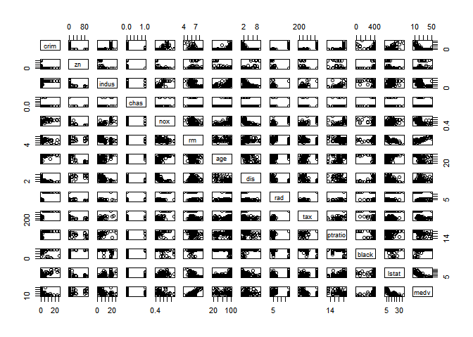
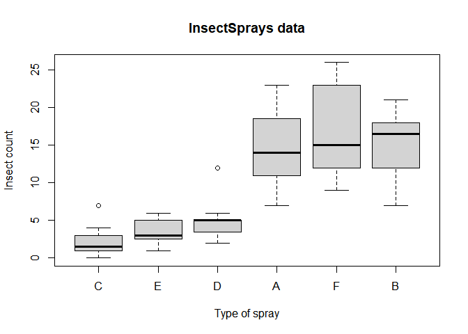
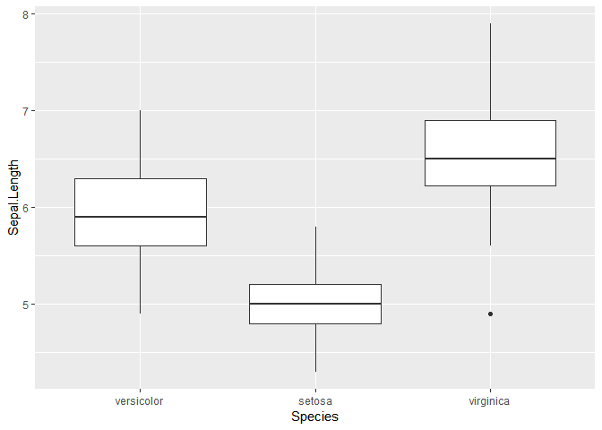
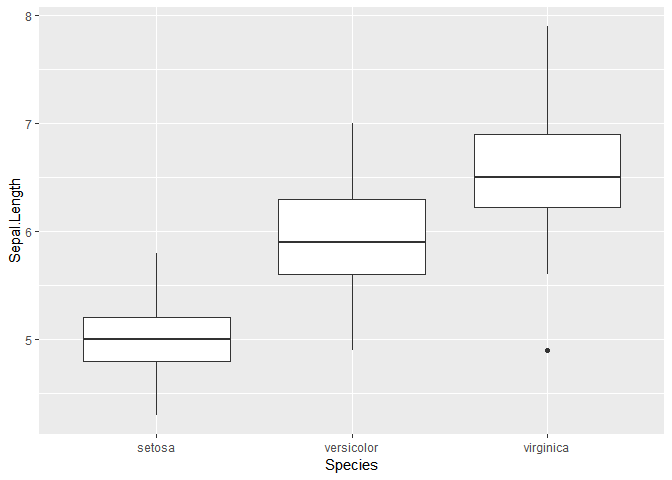
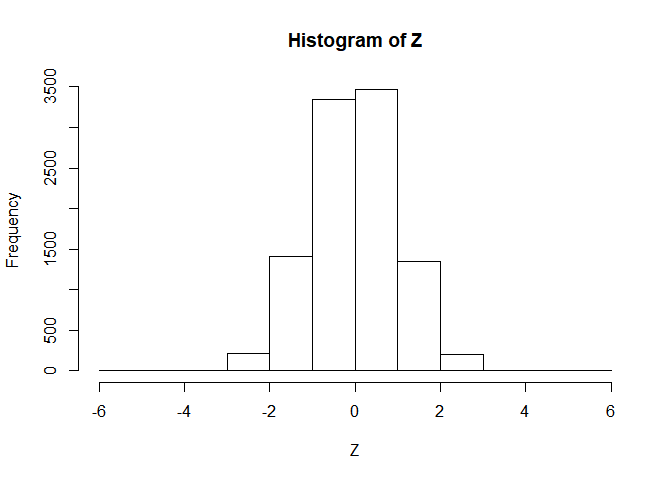
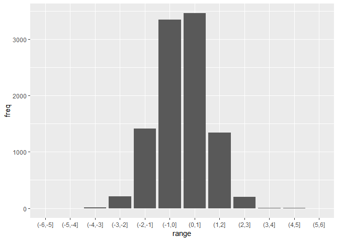

ch013(SQL and dplyr)
================
jakinpilla
2020-02-13

``` r
library(ez)
library(ggplot2)
library(nlme)
library(pastecs)
library(reshape2)
library(WRS)
library(clinfun)
library(pgirmess)
library(car)
library(tidyverse)
library(sqldf)
```

read data downloaded by shell script ————————————

``` r
boston <- read.table("./housing.data")

names(boston) <- c("crim", "zn", "indus", "chas", "nox", "rm", "age", "dis", "rad",
                   "tax", "ptratio", "black", "lstat", "medv")
glimpse(boston)
```

    ## Observations: 506
    ## Variables: 14
    ## $ crim    <dbl> 0.00632, 0.02731, 0.02729, 0.03237, 0.06905, 0.02985, ...
    ## $ zn      <dbl> 18.0, 0.0, 0.0, 0.0, 0.0, 0.0, 12.5, 12.5, 12.5, 12.5,...
    ## $ indus   <dbl> 2.31, 7.07, 7.07, 2.18, 2.18, 2.18, 7.87, 7.87, 7.87, ...
    ## $ chas    <int> 0, 0, 0, 0, 0, 0, 0, 0, 0, 0, 0, 0, 0, 0, 0, 0, 0, 0, ...
    ## $ nox     <dbl> 0.538, 0.469, 0.469, 0.458, 0.458, 0.458, 0.524, 0.524...
    ## $ rm      <dbl> 6.575, 6.421, 7.185, 6.998, 7.147, 6.430, 6.012, 6.172...
    ## $ age     <dbl> 65.2, 78.9, 61.1, 45.8, 54.2, 58.7, 66.6, 96.1, 100.0,...
    ## $ dis     <dbl> 4.0900, 4.9671, 4.9671, 6.0622, 6.0622, 6.0622, 5.5605...
    ## $ rad     <int> 1, 2, 2, 3, 3, 3, 5, 5, 5, 5, 5, 5, 5, 4, 4, 4, 4, 4, ...
    ## $ tax     <dbl> 296, 242, 242, 222, 222, 222, 311, 311, 311, 311, 311,...
    ## $ ptratio <dbl> 15.3, 17.8, 17.8, 18.7, 18.7, 18.7, 15.2, 15.2, 15.2, ...
    ## $ black   <dbl> 396.90, 396.90, 392.83, 394.63, 396.90, 394.12, 395.60...
    ## $ lstat   <dbl> 4.98, 9.14, 4.03, 2.94, 5.33, 5.21, 12.43, 19.15, 29.9...
    ## $ medv    <dbl> 24.0, 21.6, 34.7, 33.4, 36.2, 28.7, 22.9, 27.1, 16.5, ...

``` r
boston %>% dim() 
```

    ## [1] 506  14

``` r
1:nrow(boston) %>% sample(100) -> idx
```

그래프 그려지는 속도를 원활하게 하기 위해 데이터를 임의로 100개만 선택하여 산점도를 그린

``` r
plot(boston[idx, ])
```

<!-- -->

``` r
summary(boston)
```

    ##       crim                zn             indus            chas        
    ##  Min.   : 0.00632   Min.   :  0.00   Min.   : 0.46   Min.   :0.00000  
    ##  1st Qu.: 0.08204   1st Qu.:  0.00   1st Qu.: 5.19   1st Qu.:0.00000  
    ##  Median : 0.25651   Median :  0.00   Median : 9.69   Median :0.00000  
    ##  Mean   : 3.61352   Mean   : 11.36   Mean   :11.14   Mean   :0.06917  
    ##  3rd Qu.: 3.67708   3rd Qu.: 12.50   3rd Qu.:18.10   3rd Qu.:0.00000  
    ##  Max.   :88.97620   Max.   :100.00   Max.   :27.74   Max.   :1.00000  
    ##       nox               rm             age              dis        
    ##  Min.   :0.3850   Min.   :3.561   Min.   :  2.90   Min.   : 1.130  
    ##  1st Qu.:0.4490   1st Qu.:5.886   1st Qu.: 45.02   1st Qu.: 2.100  
    ##  Median :0.5380   Median :6.208   Median : 77.50   Median : 3.207  
    ##  Mean   :0.5547   Mean   :6.285   Mean   : 68.57   Mean   : 3.795  
    ##  3rd Qu.:0.6240   3rd Qu.:6.623   3rd Qu.: 94.08   3rd Qu.: 5.188  
    ##  Max.   :0.8710   Max.   :8.780   Max.   :100.00   Max.   :12.127  
    ##       rad              tax           ptratio          black       
    ##  Min.   : 1.000   Min.   :187.0   Min.   :12.60   Min.   :  0.32  
    ##  1st Qu.: 4.000   1st Qu.:279.0   1st Qu.:17.40   1st Qu.:375.38  
    ##  Median : 5.000   Median :330.0   Median :19.05   Median :391.44  
    ##  Mean   : 9.549   Mean   :408.2   Mean   :18.46   Mean   :356.67  
    ##  3rd Qu.:24.000   3rd Qu.:666.0   3rd Qu.:20.20   3rd Qu.:396.23  
    ##  Max.   :24.000   Max.   :711.0   Max.   :22.00   Max.   :396.90  
    ##      lstat            medv      
    ##  Min.   : 1.73   Min.   : 5.00  
    ##  1st Qu.: 6.95   1st Qu.:17.02  
    ##  Median :11.36   Median :21.20  
    ##  Mean   :12.65   Mean   :22.53  
    ##  3rd Qu.:16.95   3rd Qu.:25.00  
    ##  Max.   :37.97   Max.   :50.00

Sql Practice in R dataframe…—————————————————-

``` r
sql_1 <- "select Species, count(*), avg(`Sepal.Length`) from iris group by `Species`"
sqldf(sql_1)
```

    ##      Species count(*) avg(`Sepal.Length`)
    ## 1     setosa       50               5.006
    ## 2 versicolor       50               5.936
    ## 3  virginica       50               6.588

’.’이 있는 변수명들이 있어 back tic으로 변수명을 감싼다.

``` r
sql_2 <- "select Species, `Sepal.Length`, `Sepal.Width` from iris 
          where `Sepal.Length` < 4.5 order by `Sepal.Width`"

sqldf(sql_2)
```

    ##   Species Sepal.Length Sepal.Width
    ## 1  setosa          4.4         2.9
    ## 2  setosa          4.3         3.0
    ## 3  setosa          4.4         3.0
    ## 4  setosa          4.4         3.2

``` r
df1 <- tibble(x =c(1, 2), y = 2:1); df1
```

    ## # A tibble: 2 x 2
    ##       x     y
    ##   <dbl> <int>
    ## 1     1     2
    ## 2     2     1

``` r
df2 <- tibble(x = c(1, 3), a=10, b = "a"); df2
```

    ## # A tibble: 2 x 3
    ##       x     a b    
    ##   <dbl> <dbl> <chr>
    ## 1     1    10 a    
    ## 2     3    10 a

``` r
# inner join...
sql_3 <- "select * from df1 inner join df2 on df1.x = df2.x"
sqldf(sql_3)
```

    ##   x y x..3  a b
    ## 1 1 2    1 10 a

``` r
df1 %>%
  inner_join(df2, by = "x")
```

    ## # A tibble: 1 x 4
    ##       x     y     a b    
    ##   <dbl> <int> <dbl> <chr>
    ## 1     1     2    10 a

``` r
# left_join...
sql_4 <- "select * from df1 left join df2 on df1.x = df2.x"
sqldf(sql_4)
```

    ##   x y x..3  a    b
    ## 1 1 2    1 10    a
    ## 2 2 1   NA NA <NA>

``` r
df1 %>%
  left_join(df2, by = "x")
```

    ## # A tibble: 2 x 4
    ##       x     y     a b    
    ##   <dbl> <int> <dbl> <chr>
    ## 1     1     2    10 a    
    ## 2     2     1    NA <NA>

R basic funcs… ——————————————————–

rev()…

``` r
c(1,2,3) %>% rev()
```

    ## [1] 3 2 1

``` r
# ?reorder

require(graphics)
InsectSprays %>% head()
```

    ##   count spray
    ## 1    10     A
    ## 2     7     A
    ## 3    20     A
    ## 4    14     A
    ## 5    14     A
    ## 6    12     A

``` r
InsectSprays %>% tail()
```

    ##    count spray
    ## 67    13     F
    ## 68    10     F
    ## 69    26     F
    ## 70    26     F
    ## 71    24     F
    ## 72    13     F

reorder()…

``` r
bymedian <- with(InsectSprays, reorder(spray, count, median))
bymedian
```

    ##  [1] A A A A A A A A A A A A B B B B B B B B B B B B C C C C C C C C C C C
    ## [36] C D D D D D D D D D D D D E E E E E E E E E E E E F F F F F F F F F F
    ## [71] F F
    ## attr(,"scores")
    ##    A    B    C    D    E    F 
    ## 14.0 16.5  1.5  5.0  3.0 15.0 
    ## Levels: C E D A F B

``` r
with(iris, reorder(Species, Sepal.Length, median))
```

    ##   [1] setosa     setosa     setosa     setosa     setosa     setosa    
    ##   [7] setosa     setosa     setosa     setosa     setosa     setosa    
    ##  [13] setosa     setosa     setosa     setosa     setosa     setosa    
    ##  [19] setosa     setosa     setosa     setosa     setosa     setosa    
    ##  [25] setosa     setosa     setosa     setosa     setosa     setosa    
    ##  [31] setosa     setosa     setosa     setosa     setosa     setosa    
    ##  [37] setosa     setosa     setosa     setosa     setosa     setosa    
    ##  [43] setosa     setosa     setosa     setosa     setosa     setosa    
    ##  [49] setosa     setosa     versicolor versicolor versicolor versicolor
    ##  [55] versicolor versicolor versicolor versicolor versicolor versicolor
    ##  [61] versicolor versicolor versicolor versicolor versicolor versicolor
    ##  [67] versicolor versicolor versicolor versicolor versicolor versicolor
    ##  [73] versicolor versicolor versicolor versicolor versicolor versicolor
    ##  [79] versicolor versicolor versicolor versicolor versicolor versicolor
    ##  [85] versicolor versicolor versicolor versicolor versicolor versicolor
    ##  [91] versicolor versicolor versicolor versicolor versicolor versicolor
    ##  [97] versicolor versicolor versicolor versicolor virginica  virginica 
    ## [103] virginica  virginica  virginica  virginica  virginica  virginica 
    ## [109] virginica  virginica  virginica  virginica  virginica  virginica 
    ## [115] virginica  virginica  virginica  virginica  virginica  virginica 
    ## [121] virginica  virginica  virginica  virginica  virginica  virginica 
    ## [127] virginica  virginica  virginica  virginica  virginica  virginica 
    ## [133] virginica  virginica  virginica  virginica  virginica  virginica 
    ## [139] virginica  virginica  virginica  virginica  virginica  virginica 
    ## [145] virginica  virginica  virginica  virginica  virginica  virginica 
    ## attr(,"scores")
    ##     setosa versicolor  virginica 
    ##        5.0        5.9        6.5 
    ## Levels: setosa versicolor virginica

``` r
boxplot(count ~ bymedian, data = InsectSprays,
        xlab = "Type of spray", ylab = "Insect count",
        main = "InsectSprays data", varwidth = TRUE,
        col = "lightgray")
```

<!-- -->

relevel()…

``` r
data("warpbreaks")
warpbreaks %>% str()
```

    ## 'data.frame':    54 obs. of  3 variables:
    ##  $ breaks : num  26 30 54 25 70 52 51 26 67 18 ...
    ##  $ wool   : Factor w/ 2 levels "A","B": 1 1 1 1 1 1 1 1 1 1 ...
    ##  $ tension: Factor w/ 3 levels "L","M","H": 1 1 1 1 1 1 1 1 1 2 ...

``` r
# ' tension 내 'M'을 reference level로 하여 tension열에 팩터 순위를 변경한다.

warpbreaks$tension <- relevel(warpbreaks$tension, ref = "M")
warpbreaks %>% str()
```

    ## 'data.frame':    54 obs. of  3 variables:
    ##  $ breaks : num  26 30 54 25 70 52 51 26 67 18 ...
    ##  $ wool   : Factor w/ 2 levels "A","B": 1 1 1 1 1 1 1 1 1 1 ...
    ##  $ tension: Factor w/ 3 levels "M","L","H": 2 2 2 2 2 2 2 2 2 1 ...

``` r
summary(lm(breaks ~ wool + tension, data = warpbreaks))
```

    ## 
    ## Call:
    ## lm(formula = breaks ~ wool + tension, data = warpbreaks)
    ## 
    ## Residuals:
    ##     Min      1Q  Median      3Q     Max 
    ## -19.500  -8.083  -2.139   6.472  30.722 
    ## 
    ## Coefficients:
    ##             Estimate Std. Error t value Pr(>|t|)    
    ## (Intercept)   29.278      3.162   9.260    2e-12 ***
    ## woolB         -5.778      3.162  -1.827   0.0736 .  
    ## tensionL      10.000      3.872   2.582   0.0128 *  
    ## tensionH      -4.722      3.872  -1.219   0.2284    
    ## ---
    ## Signif. codes:  0 '***' 0.001 '**' 0.01 '*' 0.05 '.' 0.1 ' ' 1
    ## 
    ## Residual standard error: 11.62 on 50 degrees of freedom
    ## Multiple R-squared:  0.2691, Adjusted R-squared:  0.2253 
    ## F-statistic: 6.138 on 3 and 50 DF,  p-value: 0.00123

iris 데이터를 이용해 relevel과 reorder 함수에 활용 연습을 해보자.

``` r
iris -> iris_1
iris_1 %>% str()
```

    ## 'data.frame':    150 obs. of  5 variables:
    ##  $ Sepal.Length: num  5.1 4.9 4.7 4.6 5 5.4 4.6 5 4.4 4.9 ...
    ##  $ Sepal.Width : num  3.5 3 3.2 3.1 3.6 3.9 3.4 3.4 2.9 3.1 ...
    ##  $ Petal.Length: num  1.4 1.4 1.3 1.5 1.4 1.7 1.4 1.5 1.4 1.5 ...
    ##  $ Petal.Width : num  0.2 0.2 0.2 0.2 0.2 0.4 0.3 0.2 0.2 0.1 ...
    ##  $ Species     : Factor w/ 3 levels "setosa","versicolor",..: 1 1 1 1 1 1 1 1 1 1 ...

versicolor를 reference level로 설정한다.

``` r
iris_1$Species <- relevel(iris_1$Species, ref = 'versicolor')
iris_1 %>% str()
```

    ## 'data.frame':    150 obs. of  5 variables:
    ##  $ Sepal.Length: num  5.1 4.9 4.7 4.6 5 5.4 4.6 5 4.4 4.9 ...
    ##  $ Sepal.Width : num  3.5 3 3.2 3.1 3.6 3.9 3.4 3.4 2.9 3.1 ...
    ##  $ Petal.Length: num  1.4 1.4 1.3 1.5 1.4 1.7 1.4 1.5 1.4 1.5 ...
    ##  $ Petal.Width : num  0.2 0.2 0.2 0.2 0.2 0.4 0.3 0.2 0.2 0.1 ...
    ##  $ Species     : Factor w/ 3 levels "versicolor","setosa",..: 2 2 2 2 2 2 2 2 2 2 ...

factor의 level 순위에 의해 x축이 정렬된다.

``` r
ggplot(iris_1, aes(Species, Sepal.Length)) +
  geom_boxplot()
```

<!-- -->

Sepal.Length의 median값 순으로 Species 열의 level을 정렬하여 보자.

``` r
iris_1$Species <- with(iris_1, reorder(Species, Sepal.Length, median))

ggplot(iris_1, aes(Species, Sepal.Length)) +
  geom_boxplot()
```

<!-- -->

cut()…

``` r
Z <- stats::rnorm(10000)
table(cut(Z, breaks = -6:6))
```

    ## 
    ## (-6,-5] (-5,-4] (-4,-3] (-3,-2] (-2,-1]  (-1,0]   (0,1]   (1,2]   (2,3] 
    ##       0       0      10     210    1413    3350    3462    1342     203 
    ##   (3,4]   (4,5]   (5,6] 
    ##       9       1       0

``` r
sum(table(cut(Z, breaks = -6:6, labels = FALSE)))
```

    ## [1] 10000

``` r
graphics::hist(Z, breaks = -6:6)
```

<!-- -->

cut() 함수로 만들어진 데이터로 bar plot을 그려보자.

``` r
table(cut(Z, breaks = -6:6)) -> a
a %>% data.frame() -> df_a
colnames(df_a) <- c('range', 'freq')
df_a %>% 
  ggplot(aes(range, freq)) + geom_bar(stat = 'identity')
```

<!-- -->

``` r
tx0 <- c(9, 4, 6, 5, 3, 10, 5, 3, 5)
x <- rep(0:8, tx0)
stopifnot(table(x) == tx0)

cut(x, b = 8) # b는 breaks의 줄임말이다.
```

    ##  [1] (-0.008,1] (-0.008,1] (-0.008,1] (-0.008,1] (-0.008,1] (-0.008,1]
    ##  [7] (-0.008,1] (-0.008,1] (-0.008,1] (-0.008,1] (-0.008,1] (-0.008,1]
    ## [13] (-0.008,1] (1,2]      (1,2]      (1,2]      (1,2]      (1,2]     
    ## [19] (1,2]      (2,3]      (2,3]      (2,3]      (2,3]      (2,3]     
    ## [25] (3,4]      (3,4]      (3,4]      (4,5]      (4,5]      (4,5]     
    ## [31] (4,5]      (4,5]      (4,5]      (4,5]      (4,5]      (4,5]     
    ## [37] (4,5]      (5,6]      (5,6]      (5,6]      (5,6]      (5,6]     
    ## [43] (6,7]      (6,7]      (6,7]      (7,8.01]   (7,8.01]   (7,8.01]  
    ## [49] (7,8.01]   (7,8.01]  
    ## Levels: (-0.008,1] (1,2] (2,3] (3,4] (4,5] (5,6] (6,7] (7,8.01]

``` r
cut(x, breaks = 8)
```

    ##  [1] (-0.008,1] (-0.008,1] (-0.008,1] (-0.008,1] (-0.008,1] (-0.008,1]
    ##  [7] (-0.008,1] (-0.008,1] (-0.008,1] (-0.008,1] (-0.008,1] (-0.008,1]
    ## [13] (-0.008,1] (1,2]      (1,2]      (1,2]      (1,2]      (1,2]     
    ## [19] (1,2]      (2,3]      (2,3]      (2,3]      (2,3]      (2,3]     
    ## [25] (3,4]      (3,4]      (3,4]      (4,5]      (4,5]      (4,5]     
    ## [31] (4,5]      (4,5]      (4,5]      (4,5]      (4,5]      (4,5]     
    ## [37] (4,5]      (5,6]      (5,6]      (5,6]      (5,6]      (5,6]     
    ## [43] (6,7]      (6,7]      (6,7]      (7,8.01]   (7,8.01]   (7,8.01]  
    ## [49] (7,8.01]   (7,8.01]  
    ## Levels: (-0.008,1] (1,2] (2,3] (3,4] (4,5] (5,6] (6,7] (7,8.01]

``` r
table( cut(x, b = 8))
```

    ## 
    ## (-0.008,1]      (1,2]      (2,3]      (3,4]      (4,5]      (5,6] 
    ##         13          6          5          3         10          5 
    ##      (6,7]   (7,8.01] 
    ##          3          5

``` r
table( cut(x, breaks = 3*(-2:5)))
```

    ## 
    ## (-6,-3]  (-3,0]   (0,3]   (3,6]   (6,9]  (9,12] (12,15] 
    ##       0       9      15      18       8       0       0

``` r
table( cut(x, breaks = 3*(-2:5), right = FALSE))
```

    ## 
    ## [-6,-3)  [-3,0)   [0,3)   [3,6)   [6,9)  [9,12) [12,15) 
    ##       0       0      19      18      13       0       0

label construnction::dig.lab…

``` r
y <- stats::rnorm(100)
table(cut(y, breaks = pi/3*(-3:3)))
```

    ## 
    ## (-3.14,-2.09] (-2.09,-1.05]     (-1.05,0]      (0,1.05]   (1.05,2.09] 
    ##             1            14            35            33            16 
    ##   (2.09,3.14] 
    ##             1

``` r
table(cut(y, breaks = pi/3*(-3:3), dig.lab = 4)) # dig.lab 옵션은  표시되는 숫자의 자리수를 결정한다.
```

    ## 
    ## (-3.142,-2.094] (-2.094,-1.047]      (-1.047,0]       (0,1.047] 
    ##               1              14              35              33 
    ##   (1.047,2.094]   (2.094,3.142] 
    ##              16               1

findInterval()….

``` r
x <- 2:18
v <- c(5, 10, 15) # create two bins [5,10) and [10,15)
u <- c(5, 7, 10, 13, 15) # create two bins [5,10) and [10,15)
```

두 개의 구간이면 0, 1, 2, 3 등 4개의 인덱스를 반환하고

``` r
findInterval(x, v)
```

    ##  [1] 0 0 0 1 1 1 1 1 2 2 2 2 2 3 3 3 3

네 개의 구간이면 0, 1, 2, 3, 4, 5 등 6개의 인덱스를 반환한다.

``` r
findInterval(x, u)
```

    ##  [1] 0 0 0 1 1 2 2 2 3 3 3 4 4 5 5 5 5

``` r
cbind(x, findInterval(x, v))
```

    ##        x  
    ##  [1,]  2 0
    ##  [2,]  3 0
    ##  [3,]  4 0
    ##  [4,]  5 1
    ##  [5,]  6 1
    ##  [6,]  7 1
    ##  [7,]  8 1
    ##  [8,]  9 1
    ##  [9,] 10 2
    ## [10,] 11 2
    ## [11,] 12 2
    ## [12,] 13 2
    ## [13,] 14 2
    ## [14,] 15 3
    ## [15,] 16 3
    ## [16,] 17 3
    ## [17,] 18 3

``` r
cbind(x, findInterval(x, u))
```

    ##        x  
    ##  [1,]  2 0
    ##  [2,]  3 0
    ##  [3,]  4 0
    ##  [4,]  5 1
    ##  [5,]  6 1
    ##  [6,]  7 2
    ##  [7,]  8 2
    ##  [8,]  9 2
    ##  [9,] 10 3
    ## [10,] 11 3
    ## [11,] 12 3
    ## [12,] 13 4
    ## [13,] 14 4
    ## [14,] 15 5
    ## [15,] 16 5
    ## [16,] 17 5
    ## [17,] 18 5

``` r
N <- 100
X <- sort(round(stats::rt(N, df = 2), 2))
tt <- c(-100, seq(-2, 2, len = 201), +100)
it <- findInterval(tt, X)
tt[it < 1 | it >= N] # only first and last are outside range(X)
```

    ## [1] -100  100

aperm()…

``` r
?aperm()
```

    ## starting httpd help server ... done

``` r
x  <- array(1:24, 2:4)
xt <- aperm(x, c(2,1,3))


myarray <- array( 1:24, dim=c(2,3,4),
                  dimnames=list(One=c('a','b'), Two=c('A','B','C'), Three=1:4) )

myarray
```

    ## , , Three = 1
    ## 
    ##    Two
    ## One A B C
    ##   a 1 3 5
    ##   b 2 4 6
    ## 
    ## , , Three = 2
    ## 
    ##    Two
    ## One A  B  C
    ##   a 7  9 11
    ##   b 8 10 12
    ## 
    ## , , Three = 3
    ## 
    ##    Two
    ## One  A  B  C
    ##   a 13 15 17
    ##   b 14 16 18
    ## 
    ## , , Three = 4
    ## 
    ##    Two
    ## One  A  B  C
    ##   a 19 21 23
    ##   b 20 22 24

``` r
aperm(myarray, c(3,1,2))
```

    ## , , Two = A
    ## 
    ##      One
    ## Three  a  b
    ##     1  1  2
    ##     2  7  8
    ##     3 13 14
    ##     4 19 20
    ## 
    ## , , Two = B
    ## 
    ##      One
    ## Three  a  b
    ##     1  3  4
    ##     2  9 10
    ##     3 15 16
    ##     4 21 22
    ## 
    ## , , Two = C
    ## 
    ##      One
    ## Three  a  b
    ##     1  5  6
    ##     2 11 12
    ##     3 17 18
    ##     4 23 24

``` r
myarray[2,3,4]
```

    ## [1] 24

``` r
mynewarray <- aperm(myarray, c(3,1,2) )
mynewarray[4,2,3]
```

    ## [1] 24

``` r
library(gapminder)
gapminder[gapminder$country == 'Korea, Rep.', c('pop', 'gdpPercap')]
```

    ## # A tibble: 12 x 2
    ##         pop gdpPercap
    ##       <int>     <dbl>
    ##  1 20947571     1031.
    ##  2 22611552     1488.
    ##  3 26420307     1536.
    ##  4 30131000     2029.
    ##  5 33505000     3031.
    ##  6 36436000     4657.
    ##  7 39326000     5623.
    ##  8 41622000     8533.
    ##  9 43805450    12104.
    ## 10 46173816    15994.
    ## 11 47969150    19234.
    ## 12 49044790    23348.

``` r
gapminder[gapminder$country == 'Korea, Rep.' & gapminder$year == 2007, ]
```

    ## # A tibble: 1 x 6
    ##   country     continent  year lifeExp      pop gdpPercap
    ##   <fct>       <fct>     <int>   <dbl>    <int>     <dbl>
    ## 1 Korea, Rep. Asia       2007    78.6 49044790    23348.

``` r
f2 <- gapminder
names(f2)
```

    ## [1] "country"   "continent" "year"      "lifeExp"   "pop"       "gdpPercap"

change var name…

``` r
names(f2)[6] = 'gap_per_cap'
```

mutate or tansform vars…

``` r
f2$total_gap = f2$pop + f2$gap_per_cap
```

compute summaries…

``` r
median(gapminder$gdpPercap)
```

    ## [1] 3531.847

``` r
apply(gapminder[, 4:6], 2, mean)
```

    ##      lifeExp          pop    gdpPercap 
    ## 5.947444e+01 2.960121e+07 7.215327e+03

``` r
summary(gapminder)
```

    ##         country        continent        year         lifeExp     
    ##  Afghanistan:  12   Africa  :624   Min.   :1952   Min.   :23.60  
    ##  Albania    :  12   Americas:300   1st Qu.:1966   1st Qu.:48.20  
    ##  Algeria    :  12   Asia    :396   Median :1980   Median :60.71  
    ##  Angola     :  12   Europe  :360   Mean   :1980   Mean   :59.47  
    ##  Argentina  :  12   Oceania : 24   3rd Qu.:1993   3rd Qu.:70.85  
    ##  Australia  :  12                  Max.   :2007   Max.   :82.60  
    ##  (Other)    :1632                                                
    ##       pop              gdpPercap       
    ##  Min.   :6.001e+04   Min.   :   241.2  
    ##  1st Qu.:2.794e+06   1st Qu.:  1202.1  
    ##  Median :7.024e+06   Median :  3531.8  
    ##  Mean   :2.960e+07   Mean   :  7215.3  
    ##  3rd Qu.:1.959e+07   3rd Qu.:  9325.5  
    ##  Max.   :1.319e+09   Max.   :113523.1  
    ## 

Using dplyr…

``` r
gapminder %>%
  summarise(
    n_obs = n_distinct(country),
    n_years = n_distinct(year),
    med_gdpc = median(gdpPercap),
    max_gdppc = max(gdpPercap)
  )
```

    ## # A tibble: 1 x 4
    ##   n_obs n_years med_gdpc max_gdppc
    ##   <int>   <int>    <dbl>     <dbl>
    ## 1   142      12    3532.   113523.

``` r
gapminder %>% select(country) %>% distinct()
```

    ## # A tibble: 142 x 1
    ##    country    
    ##    <fct>      
    ##  1 Afghanistan
    ##  2 Albania    
    ##  3 Algeria    
    ##  4 Angola     
    ##  5 Argentina  
    ##  6 Australia  
    ##  7 Austria    
    ##  8 Bahrain    
    ##  9 Bangladesh 
    ## 10 Belgium    
    ## # ... with 132 more rows

``` r
gapminder %>%
  group_by(continent) %>%
  summarise(median(lifeExp))
```

    ## # A tibble: 5 x 2
    ##   continent `median(lifeExp)`
    ##   <fct>                 <dbl>
    ## 1 Africa                 47.8
    ## 2 Americas               67.0
    ## 3 Asia                   61.8
    ## 4 Europe                 72.2
    ## 5 Oceania                73.7

``` r
df1
```

    ## # A tibble: 2 x 2
    ##       x     y
    ##   <dbl> <int>
    ## 1     1     2
    ## 2     2     1

``` r
df2
```

    ## # A tibble: 2 x 3
    ##       x     a b    
    ##   <dbl> <dbl> <chr>
    ## 1     1    10 a    
    ## 2     3    10 a

``` r
df1 %>%
  full_join(df2, by = 'x')
```

    ## # A tibble: 3 x 4
    ##       x     y     a b    
    ##   <dbl> <int> <dbl> <chr>
    ## 1     1     2    10 a    
    ## 2     2     1    NA <NA> 
    ## 3     3    NA    10 a

union and union\_all…

``` r
mtcars$model <- rownames(mtcars)
first <- mtcars[1:20, ]
second <- mtcars[10:32, ]

union(first, second)
```

    ##     mpg cyl  disp  hp drat    wt  qsec vs am gear carb               model
    ## 1  21.0   6 160.0 110 3.90 2.620 16.46  0  1    4    4           Mazda RX4
    ## 2  21.0   6 160.0 110 3.90 2.875 17.02  0  1    4    4       Mazda RX4 Wag
    ## 3  22.8   4 108.0  93 3.85 2.320 18.61  1  1    4    1          Datsun 710
    ## 4  21.4   6 258.0 110 3.08 3.215 19.44  1  0    3    1      Hornet 4 Drive
    ## 5  18.7   8 360.0 175 3.15 3.440 17.02  0  0    3    2   Hornet Sportabout
    ## 6  18.1   6 225.0 105 2.76 3.460 20.22  1  0    3    1             Valiant
    ## 7  14.3   8 360.0 245 3.21 3.570 15.84  0  0    3    4          Duster 360
    ## 8  24.4   4 146.7  62 3.69 3.190 20.00  1  0    4    2           Merc 240D
    ## 9  22.8   4 140.8  95 3.92 3.150 22.90  1  0    4    2            Merc 230
    ## 10 19.2   6 167.6 123 3.92 3.440 18.30  1  0    4    4            Merc 280
    ## 11 17.8   6 167.6 123 3.92 3.440 18.90  1  0    4    4           Merc 280C
    ## 12 16.4   8 275.8 180 3.07 4.070 17.40  0  0    3    3          Merc 450SE
    ## 13 17.3   8 275.8 180 3.07 3.730 17.60  0  0    3    3          Merc 450SL
    ## 14 15.2   8 275.8 180 3.07 3.780 18.00  0  0    3    3         Merc 450SLC
    ## 15 10.4   8 472.0 205 2.93 5.250 17.98  0  0    3    4  Cadillac Fleetwood
    ## 16 10.4   8 460.0 215 3.00 5.424 17.82  0  0    3    4 Lincoln Continental
    ## 17 14.7   8 440.0 230 3.23 5.345 17.42  0  0    3    4   Chrysler Imperial
    ## 18 32.4   4  78.7  66 4.08 2.200 19.47  1  1    4    1            Fiat 128
    ## 19 30.4   4  75.7  52 4.93 1.615 18.52  1  1    4    2         Honda Civic
    ## 20 33.9   4  71.1  65 4.22 1.835 19.90  1  1    4    1      Toyota Corolla
    ## 21 21.5   4 120.1  97 3.70 2.465 20.01  1  0    3    1       Toyota Corona
    ## 22 15.5   8 318.0 150 2.76 3.520 16.87  0  0    3    2    Dodge Challenger
    ## 23 15.2   8 304.0 150 3.15 3.435 17.30  0  0    3    2         AMC Javelin
    ## 24 13.3   8 350.0 245 3.73 3.840 15.41  0  0    3    4          Camaro Z28
    ## 25 19.2   8 400.0 175 3.08 3.845 17.05  0  0    3    2    Pontiac Firebird
    ## 26 27.3   4  79.0  66 4.08 1.935 18.90  1  1    4    1           Fiat X1-9
    ## 27 26.0   4 120.3  91 4.43 2.140 16.70  0  1    5    2       Porsche 914-2
    ## 28 30.4   4  95.1 113 3.77 1.513 16.90  1  1    5    2        Lotus Europa
    ## 29 15.8   8 351.0 264 4.22 3.170 14.50  0  1    5    4      Ford Pantera L
    ## 30 19.7   6 145.0 175 3.62 2.770 15.50  0  1    5    6        Ferrari Dino
    ## 31 15.0   8 301.0 335 3.54 3.570 14.60  0  1    5    8       Maserati Bora
    ## 32 21.4   4 121.0 109 4.11 2.780 18.60  1  1    4    2          Volvo 142E

``` r
union_all(first, second)
```

    ##     mpg cyl  disp  hp drat    wt  qsec vs am gear carb               model
    ## 1  21.0   6 160.0 110 3.90 2.620 16.46  0  1    4    4           Mazda RX4
    ## 2  21.0   6 160.0 110 3.90 2.875 17.02  0  1    4    4       Mazda RX4 Wag
    ## 3  22.8   4 108.0  93 3.85 2.320 18.61  1  1    4    1          Datsun 710
    ## 4  21.4   6 258.0 110 3.08 3.215 19.44  1  0    3    1      Hornet 4 Drive
    ## 5  18.7   8 360.0 175 3.15 3.440 17.02  0  0    3    2   Hornet Sportabout
    ## 6  18.1   6 225.0 105 2.76 3.460 20.22  1  0    3    1             Valiant
    ## 7  14.3   8 360.0 245 3.21 3.570 15.84  0  0    3    4          Duster 360
    ## 8  24.4   4 146.7  62 3.69 3.190 20.00  1  0    4    2           Merc 240D
    ## 9  22.8   4 140.8  95 3.92 3.150 22.90  1  0    4    2            Merc 230
    ## 10 19.2   6 167.6 123 3.92 3.440 18.30  1  0    4    4            Merc 280
    ## 11 17.8   6 167.6 123 3.92 3.440 18.90  1  0    4    4           Merc 280C
    ## 12 16.4   8 275.8 180 3.07 4.070 17.40  0  0    3    3          Merc 450SE
    ## 13 17.3   8 275.8 180 3.07 3.730 17.60  0  0    3    3          Merc 450SL
    ## 14 15.2   8 275.8 180 3.07 3.780 18.00  0  0    3    3         Merc 450SLC
    ## 15 10.4   8 472.0 205 2.93 5.250 17.98  0  0    3    4  Cadillac Fleetwood
    ## 16 10.4   8 460.0 215 3.00 5.424 17.82  0  0    3    4 Lincoln Continental
    ## 17 14.7   8 440.0 230 3.23 5.345 17.42  0  0    3    4   Chrysler Imperial
    ## 18 32.4   4  78.7  66 4.08 2.200 19.47  1  1    4    1            Fiat 128
    ## 19 30.4   4  75.7  52 4.93 1.615 18.52  1  1    4    2         Honda Civic
    ## 20 33.9   4  71.1  65 4.22 1.835 19.90  1  1    4    1      Toyota Corolla
    ## 21 19.2   6 167.6 123 3.92 3.440 18.30  1  0    4    4            Merc 280
    ## 22 17.8   6 167.6 123 3.92 3.440 18.90  1  0    4    4           Merc 280C
    ## 23 16.4   8 275.8 180 3.07 4.070 17.40  0  0    3    3          Merc 450SE
    ## 24 17.3   8 275.8 180 3.07 3.730 17.60  0  0    3    3          Merc 450SL
    ## 25 15.2   8 275.8 180 3.07 3.780 18.00  0  0    3    3         Merc 450SLC
    ## 26 10.4   8 472.0 205 2.93 5.250 17.98  0  0    3    4  Cadillac Fleetwood
    ## 27 10.4   8 460.0 215 3.00 5.424 17.82  0  0    3    4 Lincoln Continental
    ## 28 14.7   8 440.0 230 3.23 5.345 17.42  0  0    3    4   Chrysler Imperial
    ## 29 32.4   4  78.7  66 4.08 2.200 19.47  1  1    4    1            Fiat 128
    ## 30 30.4   4  75.7  52 4.93 1.615 18.52  1  1    4    2         Honda Civic
    ## 31 33.9   4  71.1  65 4.22 1.835 19.90  1  1    4    1      Toyota Corolla
    ## 32 21.5   4 120.1  97 3.70 2.465 20.01  1  0    3    1       Toyota Corona
    ## 33 15.5   8 318.0 150 2.76 3.520 16.87  0  0    3    2    Dodge Challenger
    ## 34 15.2   8 304.0 150 3.15 3.435 17.30  0  0    3    2         AMC Javelin
    ## 35 13.3   8 350.0 245 3.73 3.840 15.41  0  0    3    4          Camaro Z28
    ## 36 19.2   8 400.0 175 3.08 3.845 17.05  0  0    3    2    Pontiac Firebird
    ## 37 27.3   4  79.0  66 4.08 1.935 18.90  1  1    4    1           Fiat X1-9
    ## 38 26.0   4 120.3  91 4.43 2.140 16.70  0  1    5    2       Porsche 914-2
    ## 39 30.4   4  95.1 113 3.77 1.513 16.90  1  1    5    2        Lotus Europa
    ## 40 15.8   8 351.0 264 4.22 3.170 14.50  0  1    5    4      Ford Pantera L
    ## 41 19.7   6 145.0 175 3.62 2.770 15.50  0  1    5    6        Ferrari Dino
    ## 42 15.0   8 301.0 335 3.54 3.570 14.60  0  1    5    8       Maserati Bora
    ## 43 21.4   4 121.0 109 4.11 2.780 18.60  1  1    4    2          Volvo 142E
