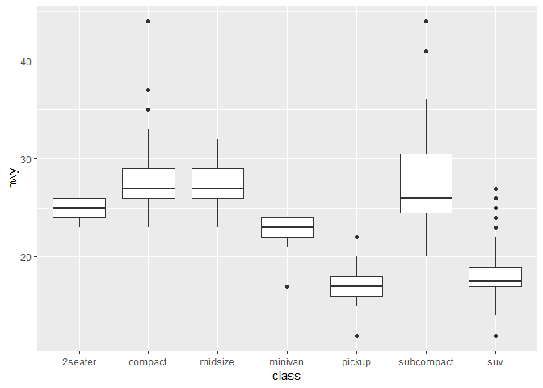

ch04(ggplot2)
================
jakinpilla
2020-02-14

  - [Numeric and factor var…](#numeric-and-factor-var)
  - [Two factor vars….](#two-factor-vars.)
  - [Faceting](#faceting)

``` r
library(ez)
library(ggplot2)
library(nlme)
library(pastecs)
library(reshape2)
library(WRS)
library(clinfun)
library(pgirmess)
library(car)
library(tidyverse)
library(sqldf)
library(gapminder)
library(gridExtra)
```

Read data downloaded by shell script

``` r
boston <- read.table("./housing.data")
glimpse(gapminder)
```

    ## Observations: 1,704
    ## Variables: 6
    ## $ country   <fct> Afghanistan, Afghanistan, Afghanistan, Afghanistan, ...
    ## $ continent <fct> Asia, Asia, Asia, Asia, Asia, Asia, Asia, Asia, Asia...
    ## $ year      <int> 1952, 1957, 1962, 1967, 1972, 1977, 1982, 1987, 1992...
    ## $ lifeExp   <dbl> 28.801, 30.332, 31.997, 34.020, 36.088, 38.438, 39.8...
    ## $ pop       <int> 8425333, 9240934, 10267083, 11537966, 13079460, 1488...
    ## $ gdpPercap <dbl> 779.4453, 820.8530, 853.1007, 836.1971, 739.9811, 78...

``` r
opar = par(mfrow=c(2,2))
hist(gapminder$lifeExp)
hist(gapminder$gdpPercap, nclass=10)
hist(log(gapminder$gdpPercap), nclass=10)
plot(log10(gapminder$gdpPercap), gapminder$lifeExp, cex=.5)
```

<!-- -->

``` r
par(opar)

cor(gapminder$lifeExp, log10(gapminder$gdpPercap))
```

    ## [1] 0.8076179

동일하게 ggplot()을 이용하여 그릴 수 있다.

``` r
p1 <- gapminder %>% ggplot(aes(x = lifeExp)) + geom_histogram()
p2 <- gapminder %>% ggplot(aes(x = gdpPercap)) + geom_histogram()
p3 <- gapminder %>% ggplot(aes(x = gdpPercap)) + geom_histogram() + scale_x_log10()
# scale_x_log10()은 x축의 scale을 log10으로 변환시켜 준다.
p4 <- gapminder %>% ggplot(aes(x = gdpPercap, y = lifeExp)) + geom_point() + 
  scale_x_log10() + geom_smooth()
grid.arrange(p1, p2, p3, p4, ncol=2)
```

    ## `stat_bin()` using `bins = 30`. Pick better value with `binwidth`.
    ## `stat_bin()` using `bins = 30`. Pick better value with `binwidth`.
    ## `stat_bin()` using `bins = 30`. Pick better value with `binwidth`.

    ## `geom_smooth()` using method = 'gam' and formula 'y ~ s(x, bs = "cs")'

<!-- -->

``` r
gl(3, 10, labels = c('a', 'b', 'c'))
```

    ##  [1] a a a a a a a a a a b b b b b b b b b b c c c c c c c c c c
    ## Levels: a b c

``` r
df <- data.frame(gp = factor(rep(letters[1:3], each = 10)), y = rnorm(30))
df <- data.frame(gp = gl(3, 10, labels = c('a', 'b', 'c')), y = rnorm(30))
ds <- df %>% group_by(gp) %>% summarise(mean = mean(y), sd = sd(y))
ds
```

    ## # A tibble: 3 x 3
    ##   gp      mean    sd
    ##   <fct>  <dbl> <dbl>
    ## 1 a     -0.200 0.781
    ## 2 b      0.145 1.52 
    ## 3 c     -0.214 0.785

geom\_point()와 geom\_errorbar() 함수를 활용해보자.

``` r
ggplot() +
  geom_point(data = df,aes(x = gp, y = y)) +
  geom_point(data = ds, aes(x = gp, y = mean), colour = 'red', size = 3) +
  geom_errorbar(data = ds, aes(x = gp, y = mean, 
                               ymin = mean - sd, 
                               ymax = mean + sd),
                
                colour = 'red', width = .4)
```

    ## Warning: Ignoring unknown aesthetics: y

<!-- -->

geom\_errorbar() 함수의 옵션을 조정하여 보자.

``` r
ggplot() +
  geom_point(data = df,aes(x = gp, y = y)) +
  geom_point(data = ds, aes(x = gp, y = mean), colour = 'red', size = 3) +
  geom_errorbar(data = ds, aes(x = gp, y = mean, 
                               ymin = mean - sd, 
                               ymax = mean + sd),
                
                colour = 'blue', width = .2)
```

    ## Warning: Ignoring unknown aesthetics: y

<!-- -->

``` r
data("diamonds", "mpg")
diamonds
```

    ## # A tibble: 53,940 x 10
    ##    carat cut       color clarity depth table price     x     y     z
    ##    <dbl> <ord>     <ord> <ord>   <dbl> <dbl> <int> <dbl> <dbl> <dbl>
    ##  1 0.23  Ideal     E     SI2      61.5    55   326  3.95  3.98  2.43
    ##  2 0.21  Premium   E     SI1      59.8    61   326  3.89  3.84  2.31
    ##  3 0.23  Good      E     VS1      56.9    65   327  4.05  4.07  2.31
    ##  4 0.290 Premium   I     VS2      62.4    58   334  4.2   4.23  2.63
    ##  5 0.31  Good      J     SI2      63.3    58   335  4.34  4.35  2.75
    ##  6 0.24  Very Good J     VVS2     62.8    57   336  3.94  3.96  2.48
    ##  7 0.24  Very Good I     VVS1     62.3    57   336  3.95  3.98  2.47
    ##  8 0.26  Very Good H     SI1      61.9    55   337  4.07  4.11  2.53
    ##  9 0.22  Fair      E     VS2      65.1    61   337  3.87  3.78  2.49
    ## 10 0.23  Very Good H     VS1      59.4    61   338  4     4.05  2.39
    ## # ... with 53,930 more rows

``` r
mpg
```

    ## # A tibble: 234 x 11
    ##    manufacturer model displ  year   cyl trans drv     cty   hwy fl    class
    ##    <chr>        <chr> <dbl> <int> <int> <chr> <chr> <int> <int> <chr> <chr>
    ##  1 audi         a4      1.8  1999     4 auto~ f        18    29 p     comp~
    ##  2 audi         a4      1.8  1999     4 manu~ f        21    29 p     comp~
    ##  3 audi         a4      2    2008     4 manu~ f        20    31 p     comp~
    ##  4 audi         a4      2    2008     4 auto~ f        21    30 p     comp~
    ##  5 audi         a4      2.8  1999     6 auto~ f        16    26 p     comp~
    ##  6 audi         a4      2.8  1999     6 manu~ f        18    26 p     comp~
    ##  7 audi         a4      3.1  2008     6 auto~ f        18    27 p     comp~
    ##  8 audi         a4 q~   1.8  1999     4 manu~ 4        18    26 p     comp~
    ##  9 audi         a4 q~   1.8  1999     4 auto~ 4        16    25 p     comp~
    ## 10 audi         a4 q~   2    2008     4 manu~ 4        20    28 p     comp~
    ## # ... with 224 more rows

One numeric var…

``` r
p1 <- gapminder %>% ggplot(aes(gdpPercap)) + geom_histogram()
p2 <- gapminder %>% ggplot(aes(gdpPercap)) + geom_histogram() + scale_x_log10()
p3 <- gapminder %>% ggplot(aes(gdpPercap)) + geom_freqpoly() + scale_x_log10()
p4 <- gapminder %>% ggplot(aes(gdpPercap)) + geom_density() + scale_x_log10()
grid.arrange(p1, p2, p3, p4, ncol=2)
```

    ## `stat_bin()` using `bins = 30`. Pick better value with `binwidth`.
    ## `stat_bin()` using `bins = 30`. Pick better value with `binwidth`.
    ## `stat_bin()` using `bins = 30`. Pick better value with `binwidth`.

<!-- -->

One factor var…

막대그래프를 그려본다.

``` r
diamonds %>% ggplot(aes(cut)) + geom_bar()
```

<!-- -->

``` r
diamonds %>%
  group_by(cut) %>%
  tally() %>%
  mutate(pct = round(n / sum(n) * 100, 1))
```

    ## # A tibble: 5 x 3
    ##   cut           n   pct
    ##   <ord>     <int> <dbl>
    ## 1 Fair       1610   3  
    ## 2 Good       4906   9.1
    ## 3 Very Good 12082  22.4
    ## 4 Premium   13791  25.6
    ## 5 Ideal     21551  40

Two numeric var… - Scatter plot…

``` r
diamonds %>% ggplot(aes(carat, price)) + geom_point()
```

<!-- -->

``` r
diamonds %>% ggplot(aes(carat, price)) + geom_point(alpha = .01)
```

<!-- -->

``` r
mpg %>% ggplot(aes(cyl, hwy)) + geom_point()
```

<!-- -->

``` r
mpg %>% ggplot(aes(cyl, hwy)) + geom_jitter()
```

<!-- -->

``` r
pairs(diamonds %>% sample_n(1000))
```

<!-- -->

#### Numeric and factor var…

  - Boxplot…

<!-- end list -->

``` r
mpg %>% ggplot(aes(class, hwy)) + geom_boxplot()
```

<!-- -->

``` r
library(gridExtra)

mpg %>% ggplot(aes(class, hwy)) + geom_jitter(col = 'gray') + 
  geom_boxplot(alpha = .5) -> p1

mpg %>% mutate(class = reorder(class, hwy, median)) %>%
  ggplot(aes(class, hwy)) + geom_jitter(col = 'gray') +
  geom_boxplot(alpha = .5) -> p2

mpg %>% mutate(class = factor(class, levels = 
                                c('2seater', 'subcompact', 'compact', 'midsize',
                                  'minivan', 'suv', 'pickup'))) %>%
  ggplot(aes(class, hwy)) + geom_jitter(col = 'grey') +
  geom_boxplot(alpha = .5) -> p3


mpg %>% mutate(class = factor(class, levels = 
                                c('2seater', 'subcompact', 'compact', 'midsize',
                                  'minivan', 'suv', 'pickup'))) %>%
  ggplot(aes(class, hwy)) + geom_jitter(col = 'grey') +
  geom_boxplot(alpha = .5) + coord_flip() -> p4

grid.arrange(p1, p2, p3, p4, ncol = 2)
```

<!-- -->

``` r
par(mfrow = c(1, 1))
```

#### Two factor vars….

``` r
glimpse(data.frame(Titanic))
```

    ## Observations: 32
    ## Variables: 5
    ## $ Class    <fct> 1st, 2nd, 3rd, Crew, 1st, 2nd, 3rd, Crew, 1st, 2nd, 3...
    ## $ Sex      <fct> Male, Male, Male, Male, Female, Female, Female, Femal...
    ## $ Age      <fct> Child, Child, Child, Child, Child, Child, Child, Chil...
    ## $ Survived <fct> No, No, No, No, No, No, No, No, No, No, No, No, No, N...
    ## $ Freq     <dbl> 0, 0, 35, 0, 0, 0, 17, 0, 118, 154, 387, 670, 4, 13, ...

``` r
xtabs(Freq ~ Class + Sex + Age + Survived, data.frame(Titanic))
```

    ## , , Age = Child, Survived = No
    ## 
    ##       Sex
    ## Class  Male Female
    ##   1st     0      0
    ##   2nd     0      0
    ##   3rd    35     17
    ##   Crew    0      0
    ## 
    ## , , Age = Adult, Survived = No
    ## 
    ##       Sex
    ## Class  Male Female
    ##   1st   118      4
    ##   2nd   154     13
    ##   3rd   387     89
    ##   Crew  670      3
    ## 
    ## , , Age = Child, Survived = Yes
    ## 
    ##       Sex
    ## Class  Male Female
    ##   1st     5      1
    ##   2nd    11     13
    ##   3rd    13     14
    ##   Crew    0      0
    ## 
    ## , , Age = Adult, Survived = Yes
    ## 
    ##       Sex
    ## Class  Male Female
    ##   1st    57    140
    ##   2nd    14     80
    ##   3rd    75     76
    ##   Crew  192     20

``` r
mosaicplot(Titanic, main = 'Survival on the Titanic')
```

<!-- -->

``` r
age_survive <- apply(Titanic, c(3,4), sum)
prop.table(age_survive, margin = 1) %>% round(., 3)
```

    ##        Survived
    ## Age        No   Yes
    ##   Child 0.477 0.523
    ##   Adult 0.687 0.313

``` r
sex_survived <- apply(Titanic, c(2,4), sum)
prop.table(sex_survived, margin = 1) %>% round(., 3)
```

    ##         Survived
    ## Sex         No   Yes
    ##   Male   0.788 0.212
    ##   Female 0.268 0.732

``` r
t2 = data.frame(Titanic)
t2 %>% group_by(Sex) %>%
  summarise(n = sum(Freq),
            survivors = sum(if_else(Survived == 'Yes', Freq, 0))) %>%
  mutate(rate_survived = survivors/n)
```

    ## # A tibble: 2 x 4
    ##   Sex        n survivors rate_survived
    ##   <fct>  <dbl>     <dbl>         <dbl>
    ## 1 Male    1731       367         0.212
    ## 2 Female   470       344         0.732

``` r
gapminder %>%
  filter(year == 2007) %>%
  ggplot(aes(gdpPercap,lifeExp)) +
  geom_point() + # geom_point()에 대한 옵션이 없음.
  scale_x_log10() +
  ggtitle("Gapminder data for 2007") -> p1

gapminder %>%
  filter(year == 2007) %>%
  ggplot(aes(gdpPercap,lifeExp)) +
  geom_point(aes(size = pop, col = continent)) + # size pop 옵션을 통해 pop 크기에 대한 ponit 사이즈를 조절함.
  scale_x_log10() +
  ggtitle("Gapminder data for 2007") -> p2

grid.arrange(p1, p2, ncol=2)
```

<!-- -->

### Faceting

``` r
gapminder %>%
  ggplot(aes(year, lifeExp, group = country)) +
  geom_line()
```

<!-- -->

``` r
gapminder %>%
  ggplot(aes(year, lifeExp, group = country, col = continent)) +
  geom_line()
```

<!-- -->

대륙별 년도의 변화에 따른 기대수명의 변화를 `facet_wrap()` 함수를 통해 알아보자.

``` r
gapminder %>%
  ggplot(aes(year, lifeExp, group = country)) +
  geom_line() +
  facet_wrap(~ continent)
```

<!-- -->
