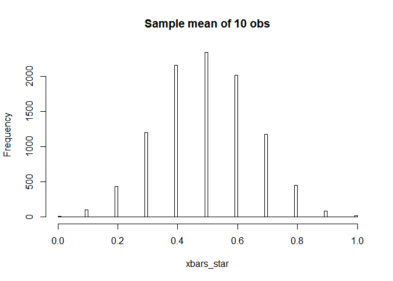

ch05(statistic concept)
================
jakinpilla
2020-02-14

  - [T 검정](#t-검정)
  - [신뢰구간의 의미…](#신뢰구간의-의미)
  - [중심극한정리](#중심극한정리)

``` r
library(ez)
library(ggplot2)
library(nlme)
library(pastecs)
library(reshape2)
library(WRS)
library(clinfun)
library(pgirmess)
library(car)
library(tidyverse)
library(sqldf)
library(gapminder)
library(gridExtra)
```

#### T 검정

sleep이라는 데이터를 불러온다. (일원분산분석에 적합한 데이터…)

``` r
sleep
```

    ##    extra group ID
    ## 1    0.7     1  1
    ## 2   -1.6     1  2
    ## 3   -0.2     1  3
    ## 4   -1.2     1  4
    ## 5   -0.1     1  5
    ## 6    3.4     1  6
    ## 7    3.7     1  7
    ## 8    0.8     1  8
    ## 9    0.0     1  9
    ## 10   2.0     1 10
    ## 11   1.9     2  1
    ## 12   0.8     2  2
    ## 13   1.1     2  3
    ## 14   0.1     2  4
    ## 15  -0.1     2  5
    ## 16   4.4     2  6
    ## 17   5.5     2  7
    ## 18   1.6     2  8
    ## 19   4.6     2  9
    ## 20   3.4     2 10

``` r
#; group이 1인 extra 열의 값을 추출한다.
sleep %>%
  filter(group == 1) %>%
  select(extra) %>% pull() -> y
```

요약통계량을 살펴본다.

``` r
summary(y)
```

    ##    Min. 1st Qu.  Median    Mean 3rd Qu.    Max. 
    ##  -1.600  -0.175   0.350   0.750   1.700   3.700

표준편차

``` r
sd(y)
```

    ## [1] 1.78901

``` r
par(mfrow=c(2, 2))
hist(y)
boxplot(y)
qqnorm(y); qqline(y)
hist(y, prob = T); lines(density(y), lty = 2)
```

<!-- -->

``` r
par(mfrow=c(1, 1))

t.test(y)
```

    ## 
    ##  One Sample t-test
    ## 
    ## data:  y
    ## t = 1.3257, df = 9, p-value = 0.2176
    ## alternative hypothesis: true mean is not equal to 0
    ## 95 percent confidence interval:
    ##  -0.5297804  2.0297804
    ## sample estimates:
    ## mean of x 
    ##      0.75

``` r
# One Sample t-test
# 
# data:  y
# t = 1.3257, df = 9, p-value = 0.2176
# alternative hypothesis: true mean is not equal to 0
# 95 percent confidence interval:
#   -0.5297804  2.0297804
# sample estimates:
#   mean of x 
# 0.75

t.test(y, alternative = 'greater')
```

    ## 
    ##  One Sample t-test
    ## 
    ## data:  y
    ## t = 1.3257, df = 9, p-value = 0.1088
    ## alternative hypothesis: true mean is greater than 0
    ## 95 percent confidence interval:
    ##  -0.2870553        Inf
    ## sample estimates:
    ## mean of x 
    ##      0.75

``` r
# One Sample t-test
# 
# data:  y
# t = 1.3257, df = 9, p-value = 0.1088
# alternative hypothesis: true mean is greater than 0
# 95 percent confidence interval:
#   -0.2870553        Inf
# sample estimates:
#   mean of x 
# 0.75 
```

평균이 0이고 표준편차가 1.8인 정규분포 곡선을 그려보자.

``` r
par(mfrow = c(1,1))
curve(dnorm(x, 0, 1.8), -4, 4)
```

<!-- -->

``` r
options(digits = 3)
set.seed(2019)

y_star <- rnorm(10, 0, 1.8)
mean(y_star - 0); sd(y_star)
```

    ## [1] -0.56

    ## [1] 1.77

``` r
t_star <- mean(y_star - 0) / (sd(y_star)/sqrt(length(y_star)))
t_star
```

    ## [1] -1

``` r
y_star <- rnorm(10, 0, 1.8)
mean(y_star - 0); sd(y_star)
```

    ## [1] -0.413

    ## [1] 2.15

``` r
t_star <- mean(y_star - 0) / (sd(y_star) / sqrt(length(y_star)))
t_star
```

    ## [1] -0.609

``` r
y_star <- rnorm(10, 0, 1.8)
mean(y_star - 0); sd(y_star)
```

    ## [1] 0.258

    ## [1] 2.49

``` r
t_star <- mean(y_star - 0) / (sd(y_star) / sqrt(length(y_star)))
t_star
```

    ## [1] 0.328

``` r
set.seed(2019)
B <- 1e4
n <- 10
xbars_star <- rep(NA, B)
sds_star <- rep(NA, B)
ts_star <- rep(NA, B)

for(b in 1:B) {
  y_star <- rnorm(n, 0, 1.789)
  m <- mean(y_star)
  s <- sd(y_star)
  xbars_star[b] <- m
  sds_star[b] <- s
  ts_star[b] <- m / (s/sqrt(n))
}

opar <- par(mfrow = c(2,2))
hist(xbars_star, nclass = 100)
abline(v = 0.75, col = 'red')

hist(sds_star, nclass = 100)
abline(v = 1.789, col = 'red')

hist(ts_star, nclass = 100)
abline(v = 1.3257, col = 'red')

qqnorm(ts_star); qqline(ts_star)
```

<!-- -->

``` r
length(which(ts_star > 1.3257)) / B
```

    ## [1] 0.108

#### 신뢰구간의 의미…

``` r
set.seed(2019)

y_star <- rnorm(10, 1, 1.8)
t.test(y_star)$conf.int
```

    ## [1] -0.827  1.707
    ## attr(,"conf.level")
    ## [1] 0.95

``` r
y_star <- rnorm(10, 1, 1.8)
t.test(y_star)$conf.int
```

    ## [1] -0.95  2.12
    ## attr(,"conf.level")
    ## [1] 0.95

``` r
y_star <- rnorm(10, 1, 1.8)
t.test(y_star)$conf.int
```

    ## [1] -0.521  3.038
    ## attr(,"conf.level")
    ## [1] 0.95

``` r
set.seed(2019)
B <- 1e2
conf_intervals <- 
  data.frame(b = rep(NA, B),
             lower = rep(NA, B),
             xbar = rep(NA, B),
             upper = rep(NA, B))

true_mu <- 1.0

for(b in 1:B){
  (y_star <- rnorm(10, true_mu, 1.8))
  conf_intervals[b, ] = c(b=b,
                          lower=t.test(y_star)$conf.int[1],
                          xbar=mean(y_star),
                          upper=t.test(y_star)$conf.int[2])
}


conf_intervals <- conf_intervals %>%
  mutate(lucky = (lower <= true_mu & true_mu <= upper))

glimpse(conf_intervals)
```

    ## Observations: 100
    ## Variables: 5
    ## $ b     <dbl> 1, 2, 3, 4, 5, 6, 7, 8, 9, 10, 11, 12, 13, 14, 15, 16, 1...
    ## $ lower <dbl> -0.8274, -0.9501, -0.5215, -0.1810, 0.1190, -0.1377, -0....
    ## $ xbar  <dbl> 0.4398, 0.5865, 1.2584, 0.7730, 1.2642, 0.6825, 0.6521, ...
    ## $ upper <dbl> 1.71, 2.12, 3.04, 1.73, 2.41, 1.50, 1.79, 2.93, 1.85, 0....
    ## $ lucky <lgl> TRUE, TRUE, TRUE, TRUE, TRUE, TRUE, TRUE, TRUE, TRUE, FA...

``` r
table(conf_intervals$lucky)
```

    ## 
    ## FALSE  TRUE 
    ##     6    94

``` r
conf_intervals %>%
  ggplot(aes(b, xbar, col = lucky)) +
  geom_point() +
  geom_errorbar(aes(ymin=lower, ymax = upper)) +
  geom_hline(yintercept = true_mu, col = 'red')
```

<!-- -->

#### 중심극한정리

``` r
par(mfrow = c(1,1))
hist(c(0,1), nclass=100, prob = TRUE, main = 'Individual sleep time increase')
```

<!-- -->

``` r
set.seed(2019)


B <- 1e4
n <- 10

xbars_star <- rep(NA, B)

for(b in 1:B) {
  xbars_star[b] <- mean(sample(c(0,1), size = n, replace = T))
}

hist(xbars_star, nclass= 100, main = 'Sample mean of 10 obs')
```

<!-- -->
