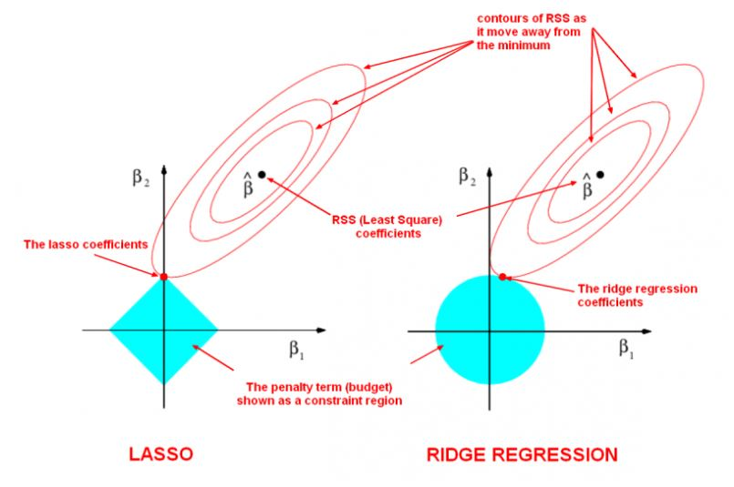

```{r setup, include=FALSE}
knitr::opts_chunk$set(echo = TRUE)
```


```{r message = FALSE, warning = FALSE}
library(tidyverse)
```


## 9.1 glmnet 함수룰 통한 라쏘 모형, 능형회귀, 변수 선택

<br>

### 9.1.1 라쏘, 능형모형, 일라스틱 넷, glmnet

- GLM 모형은 다음 수식을 풀어서 MLE(Maximum Likelihood Estimator, 최대우도추정치) $\hat{\beta}$을
찾는다. 

$$\displaystyle \lim_{\beta} \frac{1}{n} \left[  -l(y_{i}, x_{i} \beta) \right]$$

- $-l(y_{i}, x_{i}\beta)$는 관측치 $i$의 로그우도 값이다

- 독립된 변수들에 대한 확률의 곱에 대한 계산을 편리하게 하기 위해 로그를 씌워 더하기 형태로 변환한다.(곱하기에 로그를 씌우면 더하기가 되므로...)

- 편미분을 도입하여 가장 최소가 되는 지점을 찾는다. 여기서 $y_{i}$와 $x_{i}$는 고정되어진 값이고 $\beta$에 대한 편미분을 통해 전체 값이 최소가 되는 $\beta$를 찾는 것이다.

- GLM은 모든 x 변수에 대한 모수를 계산해주는데, 모수가 너무 많아지므로 모형의 해석 가능성이 떨어지고 모형의 예측능력이 떨어진다는 문제가 있다. 이를 위해 $boot::cv.glm()$을 사용해 유의미한 변수를 선택한다.

- 모형이 복잡도를 감안해주는 또 다른 방법은 모형 복잡도에 대한 벌점을 추가하는 것이다. 즉 다음 함수를 최소화하는 것이다.

$$\displaystyle \lim_{\beta} \left(  -우도(\beta, X, Y)  + 모형의 \ 복잡도(\beta) \right)$$

- 이러한 방법은 penalized maximum likelihood라고 하고 벌점을 regularization term이라고 한다. 

- LASSO regression은 모형의 복잡도를 $L1-norm : ||\beta|| = |\beta_{1}| + ... + |\beta_{p}|$를 사용한다.

$$\displaystyle \lim_{\beta} \left[  -l(y_{i}, x_{i} \beta) + \lambda \|\beta||\ \right]$$


- Ridge regressio은 모형의 복잡도를 $L2-norm : ||\beta||^{2} = \beta_{1}^{2} + ... + \beta_{p}^{2}$를 사용한다.

$$\displaystyle \lim_{\beta} \left[  -l(y_{i}, x_{i} \beta) + \lambda \|\beta||^{2}\ \right]$$

- Elasticnet은 Lasso 모형과 Ridge모형을 일반화한 다음의 모형을 푼다.

$$\displaystyle \lim_{\beta} \left[  -l(y_{i}, x_{i} \beta) + \lambda (1- \alpha) \|\beta||^{2}\ + \alpha ||\beta|| \right]$$




- $\lambda = 0$이면 MLE의 해가 되고, $\lambda$가 커질수록 regualarized model이 된다.

- Ridge의 경우에는 추정모수의 값을 원점에 가깝게 만들어주고, Lasso일 경우에는 더 많은 추정모수 값을 0으로 만들어준다. 즉, Lasso의 경우에는 더 많은 추정모수 값을 0으로 만들어준다. 즉 Lasso는 실질적인 변수선택의 방법으로 사용될 수 있다.


### 9.1.2 glmnet과 모형행렬

- `glmnet()` 함수는 모형행렬을 수동으로 만들어주어야 한다. 이는 model.matrix() 함수를 사용하면 된다. 절편항을 필요하지 않으므로 '-1'을 formula에 지정한다.


