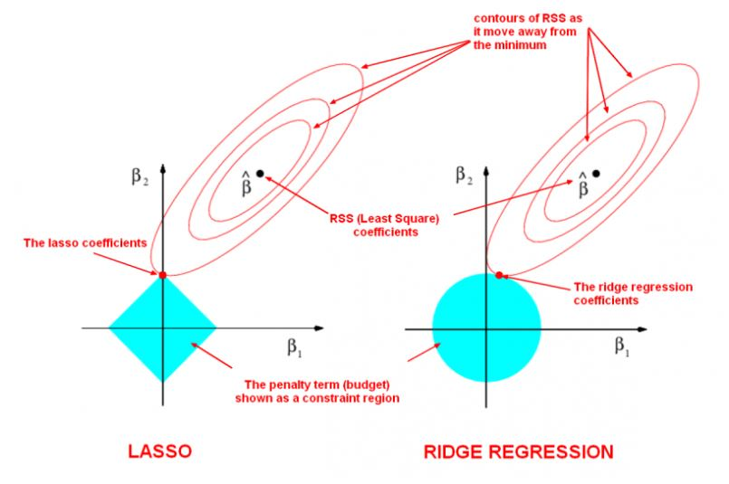

```{r setup, include=FALSE}
knitr::opts_chunk$set(echo = TRUE)
```


```{r message = FALSE, warning = FALSE}
library(tidyverse)
```


## 9.1 glmnet 함수룰 통한 라쏘 모형, 능형회귀, 변수 선택

<br>

### 9.1.1 라쏘, 능형모형, 일라스틱 넷, glmnet

- GLM 모형은 다음 수식을 풀어서 MLE(Maximum Likelihood Estimator, 최대우도추정치) $\hat{\beta}$을
찾는다. 

$$\displaystyle \lim_{\beta} \frac{1}{n} \left[  -l(y_{i}, x_{i} \beta) \right]$$

- $-l(y_{i}, x_{i}\beta)$는 관측치 $i$의 로그우도 값이다

- 독립된 변수들에 대한 확률의 곱에 대한 계산을 편리하게 하기 위해 로그를 씌워 더하기 형태로 변환한다.(곱하기에 로그를 씌우면 더하기가 되므로...)

- 편미분을 도입하여 가장 최소가 되는 지점을 찾는다. 여기서 $y_{i}$와 $x_{i}$는 고정되어진 값이고 $\beta$에 대한 편미분을 통해 전체 값이 최소가 되는 $\beta$를 찾는 것이다.

- GLM은 모든 x 변수에 대한 모수를 계산해주는데, 모수가 너무 많아지므로 모형의 해석 가능성이 떨어지고 모형의 예측능력이 떨어진다는 문제가 있다. 이를 위해 $boot::cv.glm()$을 사용해 유의미한 변수를 선택한다.

- 모형이 복잡도를 감안해주는 또 다른 방법은 모형 복잡도에 대한 벌점을 추가하는 것이다. 즉 다음 함수를 최소화하는 것이다.

$$\displaystyle \lim_{\beta} \left(  -우도(\beta, X, Y)  + 모형의 \ 복잡도(\beta) \right)$$

- 이러한 방법은 penalized maximum likelihood라고 하고 벌점을 regularization term이라고 한다. 

- LASSO regression은 모형의 복잡도를 $L1-norm : ||\beta|| = |\beta_{1}| + ... + |\beta_{p}|$를 사용한다.

$$\displaystyle \lim_{\beta} \left[  -l(y_{i}, x_{i} \beta) + \lambda \|\beta||\ \right]$$


- Ridge regressio은 모형의 복잡도를 $L2-norm : ||\beta||^{2} = \beta_{1}^{2} + ... + \beta_{p}^{2}$를 사용한다.

$$\displaystyle \lim_{\beta} \left[  -l(y_{i}, x_{i} \beta) + \lambda \|\beta||^{2}\ \right]$$

- Elasticnet은 Lasso 모형과 Ridge모형을 일반화한 다음의 모형을 푼다.

$$\displaystyle \lim_{\beta} \left[  -l(y_{i}, x_{i} \beta) + \lambda (1- \alpha) \|\beta||^{2}\ + \alpha ||\beta|| \right]$$




- $\lambda = 0$이면 MLE의 해가 되고, $\lambda$가 커질수록 regualarized model이 된다.

- Ridge의 경우에는 추정모수의 값을 원점에 가깝게 만들어주고, Lasso일 경우에는 더 많은 추정모수 값을 0으로 만들어준다. 즉, Lasso의 경우에는 더 많은 추정모수 값을 0으로 만들어준다. 즉 Lasso는 실질적인 변수선택의 방법으로 사용될 수 있다.


### 9.1.2 glmnet과 모형행렬

- `glmnet()` 함수는 모형행렬을 수동으로 만들어주어야 한다. 이는 model.matrix() 함수를 사용하면 된다. 절편항을 필요하지 않으므로 '-1'을 formula에 지정한다.


```{r}
adult <- read.csv("adult.data", header = F, strip.white = T)

names(adult) <- c("age", "workclass", "fnlwgt", "education", "education_num",
                  "marital_status", "occupation", "relationship", "race", "sex",
                  "capital_gain", "capital_loss", "hours_per_week", "native_country",
                  "wage")
adult %>% head()
```


```{r}
binomial_deviance <- function(y_obs, yhat) {
  epsilon = 0.0001
  yhat = ifelse(yhat < epsilon, epsilon, yhat)
  yhat = ifelse(yhat > 1- epsilon, 1-epsilon, yhat)
  a = ifelse(y_obs == 0, 0, y_obs * log(y_obs/yhat))
  b = ifelse(y_obs==1, 0, (1-y_obs) * log((1-y_obs)/(1-yhat)))
  return((2*sum(a+b)))
}

set.seed(2020)
n <- nrow(adult)
idx <- 1:n
training_idx <- sample(idx, n * .6)

idx <- setdiff(idx, training_idx) # reflesh idx...
validate_idx <- sample(idx, n * .2)
test_idx <- setdiff(idx, validate_idx)

# length(training_idx)
# length(validate_idx)
# length(test_idx)

training <- adult[training_idx, ]
validation <- adult[validate_idx, ]
test <- adult[test_idx, ]
```


```{r}
xx <- model.matrix(wage ~ .-1, adult)
x <- xx[training_idx, ]
y <- ifelse(training$wage == '>50K', 1, 0)

dim(x)
```


```{r, warning=FALSE}
library(glmnet)
ad_glmnet_fit <- glmnet(x, y)
```

```{r, fig.height=7, fig.width = 9}
library(coefplot)
coefpath(ad_glmnet_fit)
```


```{r}
plot(ad_glmnet_fit)
```


- x축은 lambda가 변함에 따라서 전체 모수벡터의 L1-norm 값을 나타낸다. 각각의 곡선은 한 변수의 모수 추정값이다. 플롯 상단의 숫자는 주어진 L1 Norm에 해당하는 0이 아닌 모수의 개수를 보여준다. 이는 실질적인 모수의 개수의 보여준다.

```{r}
ad_glmnet_fit
```

 - 행들은 Lambda, 즉 복잡도 벌점이 줄어드는 순서로 정렬된다.
 
 - 첫 행은 가장 복잡도 벌점이 크므로 가장 간단한 $y = constant$ 모형이 적합된다.(벌점이 크니까 복잡하지 않은 모형으로 적합되는 것이다.)
 
 - 가장 마지막 행은 가장 복잡도 벌점이 작으므로 가장 복잡한 모형이 적합되었다. 즉, 사용 가능한 거의 모든 변수가 사용되었다.
 
 - 자유도가 $Df= 1, \ 2$가 되는 Lambda 값에 해당하는 모수 추정값들을 살펴보려면 다음과 같이 하면 된다.
 
```{r}
coef(ad_glmnet_fit, s = c(0.1741000, 0.1317000))
```


- $Df = 1$일때 모형은 다음과 같다.

$$eta = 0.22338157  +0.03406252 \times marital_statusMarried-civ-spouse $$


- $Df = 2$일때 모형은 다음과 같다.

$$eta = 0.166246866  +0.118320874 \times marital-statusMarried-civ-spouse + 0.001821285 \times education-num$$

### 9.1.3 자동 모형 선택, cv.glmnet

 - glmnet() 함수의 결과는 다양한 lambda값에 대한 다른 모형들이다. 

 - 자동으로 모형을 선택하기 위해서는 교차검증을 수행하는 cv.glmnet() 함수를 사용한다.
 
```{r}
ad_cvfit <- cv.glmnet(x, y, family = 'binomial')
plot(ad_cvfit)
```
 

- 왼쪽으로 갈수록 복잡한 모형이며, 오른쪽으로 갈수록 간단한 모형이다.

- 모형의 정확도는 이항편차로 주어진다. 이 값이 작을수록 정확한 모형이다.

- 각 $\lambda$값에서 k-fold 교차검증은 k-개의 테스크 오차값을 산출하고 그 값들의 표준편차 값이 오차범위로 나타난다. 삘간점은 주어진 $\lambda$값의 평균값이다.

- 최적의 $\lambda$값은 두 종류가 있다. 첫째, 교차검즈 오차의 평균값을 최소화하는 `lambda.min`과 둘째, 교차검증 오차의 평균값이 최소값으로부터 `1-표준편차` 이상 떨어지지 않은 가장 간단한 `lambda.1se`이다.

- 최적의 $\lambda$ 값의 로그값은 다음과 같다.

```{r}
log(ad_cvfit$lambda.min)
```

```{r}
log(ad_cvfit$lambda.1se)
```

- 최적의 $\lambda$ 값에서 모수의 값들을 보려면 s = option에 lambda.min, lambda.1se을 설정하여 주면 된다.

```{r}
coef(ad_cvfit, s = ad_cvfit$lambda.1se)
```

```{r}
coef(ad_cvfit, s = ad_cvfit$lambda.min)
```

```{r}
which(coef(ad_cvfit, s = 'lambda.min') > 0) %>% length()
```

```{r}
which(coef(ad_cvfit, s = 'lambda.1se') > 0) %>% length()
```

- glmnet() 함수는 default로 $\alpha = 1$, 즉 Lasso를 선택한다.

```{r}
set.seed(2020)
foldid <- sample(1:10, size = length(y), replace = T)

cv1 <- cv.glmnet(x, y, foldid = foldid, alpha = 1, family = 'binomial')
```

```{r}
cv.5 <- cv.glmnet(x, y, foldid = foldid, alpha = .5, family = 'binomial')
```

```{r}
cv0 <- cv.glmnet(x, y, foldid = foldid, alpha = 0)
```

```{r, fig.height=15}
par(mfrow = c(2, 2))
plot(cv1, main = 'Alpha = 1.0')
plot(cv.5, main = 'Alpha = .5')
plot(cv0, main = 'Alpha = 0' )

plot(log(cv1$lambda), cv1$cvm, pch = 19, col='red', 
     xlab = 'log(Lambda)', ylab = cv1$name, main = 'alpha = 1.0')
points(log(cv.5$lambda), cv.5$cvm, pch = 19, col = 'grey')
points(log(cv0$lambda), cv0$cvm, pch = 19, col = 'blue')

legend('topleft', legend = c('alpha = 1', 'alpha = .5', 'alpha = 0'), 
       pch = 19, col = c('red', 'grey', 'blue'))
```


### 9.1.5 예측, predict.glmnet

```{r}
predict(ad_cvfit, s = 'lambda.1se', newx = x[1:5, ], type = 'response')
```

### 9.1.6 모형평가

- ROC graph

```{r}
y_obs <- ifelse(validation$wage == '>50K', 1, 0)
yhat_glmnet <- predict(ad_cvfit, s = 'lambda.1se', newx = xx[validate_idx, ], 
                      type ='response')

yhat_glmnet <- yhat_glmnet[, 1]

binomial_deviance(y_obs, yhat_glmnet)

library(ROCR)
pred_glmnet <- prediction(yhat_glmnet, y_obs)
perf_glment <- performance(pred_glmnet, measure = 'tpr', x.measure = 'fpr')

plot(perf_glment, col = 'blue', main = 'ROC Curve')
abline(0, 1)
legend('bottomright', inset = .1, 
       legend = c('glmnet'), 
       col = c('blue'), 
       lty = 1, 
       lwd = 2)
```

- AUC 

```{r}
performance(pred_glmnet, 'auc')@y.values[[1]]
```

- 23개의 변수만을 사용해서 101개의 모든 변수를 사용한 glm모형과 비슷한 성능을 낸다.


## 9.2 나무 모형

### 9.2.1. 나무모형이란?

- 먼저 그리디(greedy)한 방법으로 재귀적 이항나무(resurcive binary tree splitting)을 행하고, 

- 가지치기(prunning)를 하여 여러 모형을 생성한 후,

- 내부적으로 K-fold CV를 행하여 최적의 모형을 선택한다.

$$G = p(1 - p)$$

- 만약 성공과 실패가 반반씩 있다면 $G = 1/4$을 가지는데 이것이 지니지수의 최재값이다. 

### 9.2.2 나무 모형 적합

```{r}
library(rpart)
cvr_tr <- rpart(wage ~ ., data = training)
cvr_tr
```

```{r}
printcp(cvr_tr)
```

```{r}
plotcp(cvr_tr)
```

  - error가 가장 낮은 split 개수를 선택한다.
  
```{r}
opar <- par(mfrow = c(1, 1), xpd = NA)
ptree <- prune(cvr_tr, 
             cp=cvr_tr$cptable[which.min(cvr_tr$cptable[,"xerror"]),"CP"])

plot(ptree)
text(ptree)
```
